## 浅谈我对动态规划的一点理解---大家准备好小板凳，我要开始吹牛皮了~~~

### 前言

作为一个退役狗跟大家扯这些东西，感觉确实有点。。。但是，针对网上没有一篇文章能够很详细的把动态规划问题说明的很清楚，我决定还是拿出我的全部家当，来跟大家分享我对动态规划的理解，我会尽可能的把所遇到的动态规划的问题都涵盖进去，博主退役多年，可能有些地方会讲的不完善，还望大家多多贡献出自己的宝贵建议，共同进步~~~

### 概念

首先我们得知道动态规划是什么东东，百度百科上是这么说的，动态规划 `(dynamic programming)` 是运筹学的一个分支，是求解决策过程 `(decision process)` 最优化的数学方法。20世纪50年代初美国数学家 `R.E.Bellman` 等人在研究多阶段决策过程 `(multistep decision process)` 的优化问题时，提出了著名的最优化原理 `(principle of optimality)` ，把多阶段过程转化为一系列单阶段问题，利用各阶段之间的关系，逐个求解，创立了解决这类过程优化问题的新方法——动态规划。1957年出版了他的名著 `《Dynamic Programming》` ，这是该领域的第一本著作。

小伙伴们估计看到这段话都已经蒙圈了吧，那么动态规划到底是什么呢？这么说吧，动态规划就是一种通过把原问题分解为相对简单的子问题的方式求解复杂问题的方法。动态规划常常适用于有重叠子问题和最优子结构性质的问题。

举个例子，我们都是从学生时代过来的人，学生时代我们最喜欢的一件事是什么呢？就是等待寒暑假的到来，因为可以放假了啊^-^，嘻嘻，谁会不喜欢玩呢~~可是呢，放假之前我们必须经历的一个过程就是期末考试，期末没考好，回家肯定是要挨板子的，所以我们就需要去复习啦，而在复习过程中我们是不是要去熟记书中的每一个知识点呢，书是一个主体，考试都是围绕着书本出题，所以我们很容易知道书本不是核心，书本中的若干个知识点才是核心，然后那个若干个知识点又可以拆解成无数个小知识点，是不是发现有点像一棵倒立的树呢，但是呢，当我们要运用这些知识点去解题时，每一道题所涉及的知识点，其实就是这些知识点的一个排列组合的所有可能结果的其中一种组合方式，这个能理解的了嘛？

对这个排列组合，我们举个例子，比如小明爸爸叫小明去买一包5元钱的香烟，他给了一张 `5` 元的，三张 `2` 元的，五张 `1` 元的纸币，问小明有几种付钱的方式？这个选择方式我们很容易就知道，我们可以对这些可能结果进行一个枚举。

这个组合方式有很多种，我们可以对其进行一个分类操作：

- 当我们只用一张纸币的时候：一张 `5` 元纸币

- 当我们需要用两张纸币的时候：结果不存在

- 当我们需要用三张纸币的时候：两张 `2` 元纸币和一张 `1` 元纸币

- 当我们需要用四张纸币的时候：一张2元纸币，三张一元纸币

- 当我们需要用五张纸币的时候：五张一元纸币

从上面的分类分析来看，我们知道，排列组合的方式共有四种，而我如果问你，我现在需要花费的纸币张数要最小，我们应该选取哪种方式呢，很显然我们直接选取第一种方法，使用一张 `5` 元的纸币就好了啊，这个就是求最优解的问题啦，也就是我们今天需要研究的问题，动态规划问题

相信大家到了这里，对动态规划应该有了初步的认识吧，我也很高兴带大家一起畅游算法的美妙，那么请继续听我吹牛皮吧，啦啦啦~~~

### 基本思想

若要解一个给定问题，我们需要解其不同部分（即子问题），再合并子问题的解以得出原问题的解。 通常许多子问题非常相似，为此动态规划法试图仅仅解决每个子问题一次，从而减少计算量： 一旦某个给定子问题的解已经算出，则将其记忆化存储，以便下次需要同一个子问题解之时直接查表。 这种做法在重复子问题的数目关于输入的规模呈指数增长时特别有用。

简单来说，还是拿上面的例子来讲，比如说你做一道数学难题，难题，无非就是很难嘛，但是我们需要做的就是把这道难题解出来，对于一个数学水平很菜的选手来讲，做出一道难题是不是会感觉非常困难呢？其实换个角度来看待这个问题，一道难题其实是由若干个子问题构成，而每一个子问题也许会是一些很基础的问题，一个入门级的问题，类似于像 `1+1=2` 这样的问题，相信大家只要有所接触都能熟练掌握，而针对这些难题，我们也应该去考虑把它进行一个分解，我现在脑边还能回忆起中学老师说过的话，做不来的题目你可以把一些解题过程先写出来，把最基本的思路写出来，写着写着说不定答案就出来了呢？相信看完我这篇文章的人水平都能再上一个台阶，不仅如此，对于当前的全球热潮 `Artificial Intelligence` 也是如此，看似非常复杂繁琐的算法，把它进行一个拆解，其实就是若干个数学公式的组合，最根本的来源还是基础数学，所以啊，学好数学，未来是光明的~~~

### 分治与动态规划

**共同点**：二者都要求原问题具有最优子结构性质,都是将原问题分而治之,分解成若干个规模较小(小到很容易解决的程序)的子问题.然后将子问题的解合并,形成原问题的解.

**不同点：**分治法将分解后的子问题看成相互独立的，通过用递归来做。

动态规划将分解后的子问题理解为相互间有联系,有重叠部分，需要记忆，通常用迭代来做。

### 问题特征

最优子结构：当问题的最优解包含了其子问题的最优解时，称该问题具有最优子结构性质。

重叠子问题：在用递归算法自顶向下解问题时，每次产生的子问题并不总是新问题，有些子问题被反复计算多次。动态规划算法正是利用了这种子问题的重叠性质，对每一个子问题只解一次，而后将其解保存在一个表格中，在以后尽可能多地利用这些子问题的解。

我认为可能会和回溯的部分问题有点类似，有兴趣的同学可以自行阅读一下我曾经写过的文章[回溯算法入门及经典案例剖析(初学者必备宝典)](http://www.cnblogs.com/ECJTUACM-873284962/p/8447050.html)

### 解题步骤

**1.找出最优解的性质，刻画其结构特征和最优子结构特征，将原问题分解成若干个子问题；**

把原问题分解为若干个子问题，子问题和原问题形式相同或类似，只不过规模变小了。子问题都解决，原问题即解决，子问题的解一旦求出就会被保存，所以每个子问题只需求解一次。

**2.递归地定义最优值，刻画原问题解与子问题解间的关系，确定状态；**

在用动态规划解题时，我们往往将和子问题相关的各个变量的一组取值，称之为一个“状态”。一个“状态”对应于一个或多个子问题， 所谓某个“状态”下的“值”，就是这个“状 态”所对应的子问题的解。所有“状态”的集合，构成问题的“状态空间”。“状态空间”的大小，与用动态规划解决问题的时间复杂度直接相关。

**3.以自底向上的方式计算出各个子问题、原问题的最优值，并避免子问题的重复计算；**

定义出什么是“状态”，以及在该“状态”下的“值”后，就要找出不同的状态之间如何迁移――即如何从一个或多个“值”已知的 “状态”，求出另一个“状态”的“值”(递推型)。

**4.根据计算最优值时得到的信息，构造最优解，确定转移方程;**

状态的迁移可以用递推公式表示，此递推公式也可被称作“状态转移方程”。

### 实例分析

#### 1.01背包问题

有 `N` 件物品和一个容量为 `V` 的背包。第i件物品的费用是 `c[i]` ，价值是 `w[i]` 。求解将哪些物品装入背包可使这些物品的费用总和不超过背包容量，且价值总和最大。 

`f[i][v]`表示前i件物品恰放入一个容量为v的背包可以获得的最大价值。则其状态转移方程便是：`f[i][v]=max{f[i-1][v],f[i-1][v-c[i]]+w[i]}` 。

将前i件物品放入容量为 `v` 的背包中”这个子问题，若只考虑第i件物品的策略（放或不放），那么就可以转化为一个只牵扯前 `i-1` 件物品的问题。如果不放第i件物品，那么问题就转化为"前 `i-1` 件物品放入容量为 `v` 的背包中"；如果放第 `i` 件物品，那么问题就转化为"前 `i-1` 件物品放入剩下的容量为 `v-c[i]` 的背包中”，此时能获得的最大价值就是 `f [i-1][v-c[i]]` 再加上通过放入第i件物品获得的价值 `w[i]` 。

对 `01` 背包不清楚的或者有兴趣阅读的同学请移步至[这里](http://www.cnblogs.com/ECJTUACM-873284962/p/6815610.html)

下面贴下 `01` 背包的模板

```C++
void backtrack(int i,int cp,int cw)
{
    if(i>n)
    {
        if(cp>bestp)
        {
            bestp=cp;
            for(i=1;i<=n;i++) bestx[i]=x[i];
        }
    }
    else
    {
        for(int j=0;j<=1;j++)  
        {
            x[i]=j;
            if(cw+x[i]*w[i]<=c)  
            {
                cw+=w[i]*x[i];
                cp+=p[i]*x[i];
                backtrack(i+1,cp,cw);
                cw-=w[i]*x[i];
                cp-=p[i]*x[i];
            }
        }
    }
}
```

最终我们可以去得到答案：

```c++
int n,c,bestp;//物品个数,背包容量,最大价值
int p[10000],w[10000],x[10000],bestx[10000];//物品的价值,物品的重量,物品的选中情况
int main()
{
    bestp=0; 
    cin>>c>>n;
    for(int i=1;i<=n;i++) cin>>w[i];
    for(int i=1;i<=n;i++) cin>>p[i];
    backtrack(1,0,0);
    cout<<bestp<<endl;
}
```

#### 2.矩阵连乘

给定 `n` 个可连乘的矩阵 `{A1, A2, …,An}` ，根据矩阵乘法结合律，可有多种不同计算次序，每种次序有不同的计算代价，也就是数乘次数。例如给定2个矩阵 `A[pi,pj]` 和 `B[pj,pk]` ， `A×B` 为 `[pi,pk]` 矩阵，数乘次数为 `pi×pj×pk` 。将矩阵连乘积 `Ai…Aj` 简记为 `A[i:j] ` ，这里 `i≤j` 。考察计算 `A[i:j]` 的最优计算次序，设这个计算次序在矩阵 `Ak` 和 `Ak+1` 之间将矩阵链断开， `i≤k<j` ，则 `A[i:j]` 的计算量 `=A[i:k]` 的计算量 `+A[k+1:j]` 的计算量 `+A[i:k]` 和 `A[k+1:j]` 相乘的计算量。计算 `A[i:j]` 的最优次序所包含的计算矩阵子链 `A[i:k]` 和 `A[k+1:j]` 的次序也是最优的。即矩阵连乘计算次序问题的最优解包含着其子问题的最优解，这种性质称为最优子结构性质，问题具有最优子结构性质是该问题可用动态规划算法求解的显著特征。

举个例子：

给出 `N` 个数，每次从中抽出一个数(第一和最后一个不能抽)，该次的得分即为抽出的数与相邻两个数的乘积。一直这样将每次的得分累加直到只剩下首尾两个数为止，问最小得分。

实现过程如下：

```c++
#define maxn 105
int dp[maxn][maxn],a[maxn]; 
int main()
{
    int n;
    cin>>n;
    int i,j,k,len;
    memset(dp,0,sizeof(dp)); 
    //len是设置步长,也就是j减i的值 
    for(i=0;i<n;i++) cin>>a[i];
    for(i=0;i<n-2;i++) dp[i][i+2]=a[i]*a[i+1]*a[i+2];
    //如果只有三个数就直接乘起来 
    for(len=3;len<n;len++)
    {
        for(i=0;i+len<n;i++)
        {    
            j=i+len;
            for(k=i+1;k<j;k++)
            {
                if(dp[i][j]==0) dp[i][j]=dp[i][k]+dp[k][j]+a[i]*a[k]*a[j];
                 else dp[i][j]=min(dp[i][j],dp[i][k]+dp[k][j]+a[i]*a[k]*a[j]);
            }
        }
    }
    cout<<dp[0][n-1]<<endl;
    return 0;
}
```

#### 3.最长公共子序列与最长公共子串

子串应该比较好理解，至于什么是子序列，这里给出一个例子：有两个母串

- `cnblogs`
- `belong`

比如序列 `bo` ,  `bg` ,  `lg` 在母串 `cnblogs` 与 `belong` 中都出现过并且出现顺序与母串保持一致，我们将其称为公共子序列。最长公共子序列` (Longest Common Subsequence, LCS)` ，顾名思义，是指在所有的子序列中最长的那一个。子串是要求更严格的一种子序列，要求在母串中连续地出现。在上述例子的中，最长公共子序列为blog（cn**blog**s, **b**e**lo**n**g**），最长公共子串为lo（cnb**lo**gs, be**lo**ng）。

对于母串 `X=<x1,x2,⋯,xm>` ,  `Y=<y1,y2,⋯,yn>` ，求 `LCS` 与最长公共子串。

**暴力解法：**

假设 `m<n` ， 对于母串 `X` ，我们可以暴力找出 `2m` 个子序列，然后依次在母串 `Y` 中匹配，算法的时间复杂度会达到指数级 `O(n∗2m)` 。显然，暴力求解不太适用于此类问题。

**动态规划：**

假设 `Z=<z1,z2,⋯,zk>` 是 `X` 与 `Y` 的 `LCS` ， 我们观察到

- 如果 `xm=yn` ，则 `zk=xm=yn` ，有 `Zk−1` 是 `Xm−1` 与 `Yn−1` 的 `LCS` ；
- 如果 `xm≠yn` ，则 `Zk` 是 `Xm` 与 `Yn−1` 的 `LCS` ，或者是 `Xm−1` 与 `Yn` 的 `LCS` 。

因此，求解 `LCS` 的问题则变成递归求解的两个子问题。但是，上述的递归求解的办法中，重复的子问题多，效率低下。改进的办法——**用空间换时间**，用数组保存中间状态，方便后面的计算。这就是动态规划 `(DP)` 的核心思想了。

**DP求解LCS**

用二维数组 `c[i][j]` 记录串 `x1x2⋯xi` 与 `y1y2⋯yj` 的 `LCS` 长度，

用 `i` , `j` 遍历两个子串 `x` , `y` ，如果两个元素相等就 `+1`  ，不等就用上一个状态最大的元素

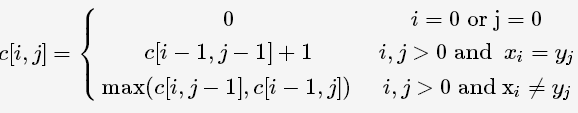

实现过程如下：

```c++
int lcs(string str1, string str2, vector<vector<int>>& vec) {
    int len1 = str1.size();
    int len2 = str2.size();
    vector<vector<int>> c(len1 + 1, vector<int>(len2 + 1, 0));
    for (int i = 0; i <= len1; i++) {
        for (int j = 0; j <= len2; j++) {
            if (i == 0 || j == 0) {
                c[i][j] = 0;
            }
            else if (str1[i - 1] == str2[j - 1]) {
                c[i][j] = c[i - 1][j - 1] + 1;
                vec[i][j] = 0;
            }
            else if (c[i - 1][j] >= c[i][j - 1]){
                c[i][j] = c[i - 1][j];
                vec[i][j] = 1;
            }
            else{
                c[i][j] = c[i][j - 1];
                vec[i][j] = 2;
            }
        }
    }

    return c[len1][len2];
}

void print_lcs(vector<vector<int>>& vec, string str, int i, int j)
{
    if (i == 0 || j == 0)
    {
        return;
    }
    if (vec[i][j] == 0)
    {
        print_lcs(vec, str, i - 1, j - 1);
        printf("%c", str[i - 1]);
    }
    else if (vec[i][j] == 1)
    {
        print_lcs(vec, str, i - 1, j);
    }
    else
    {
        print_lcs(vec, str, i, j - 1);
    }
}

int _tmain(int argc, _TCHAR* argv[])
{
    string str1 = "123456";
    string str2 = "2456";
    vector<vector<int>> vec(str1.size() + 1, vector<int>(str2.size() + 1, -1));
    int result = lcs(str1, str2, vec);

    cout << "result = " << result << endl;

    print_lcs(vec, str1, str1.size(), str2.size());

    getchar();
    return 0;
}
```

**DP求解最长公共子串**

前面提到了子串是一种特殊的子序列，因此同样可以用DP来解决。定义数组的存储含义对于后面推导转移方程显得尤为重要，糟糕的数组定义会导致异常繁杂的转移方程。考虑到子串的连续性，将二维数组c[i,j]c[i,j]用来记录具有这样特点的子串——结尾为母串x1x2⋯xix1x2⋯xi与y1y2⋯yjy1y2⋯yj的结尾——的长度。

区别就是因为是连续的，如果两个元素不等，那么就要=0了而不能用之前一个状态的最大元素

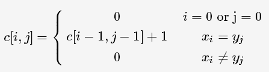

最长公共子串的长度为 `max(c[i,j])` ,  `i∈{1,⋯,m}` , `j∈{1,⋯,n}` 。

实现过程如下：

```c++
int lcs_2(string str1, string str2, vector<vector<int>>& vec) {
    int len1 = str1.size();
    int len2 = str2.size();
    int result = 0;     //记录最长公共子串长度
    vector<vector<int>> c(len1 + 1, vector<int>(len2 + 1, 0));
    for (int i = 0; i <= len1; i++) {
        for (int j = 0; j <= len2; j++) {
            if (i == 0 || j == 0) {
                c[i][j] = 0;
            }
            else if (str1[i - 1] == str2[j - 1]) {
                c[i][j] = c[i - 1][j - 1] + 1;
                vec[i][j] = 0;
                result = c[i][j] > result ? c[i][j] : result;
            }
            else {
                c[i][j] = 0;
            }
        }
    }
    return result;
}

void print_lcs(vector<vector<int>>& vec, string str, int i, int j)
{
    if (i == 0 || j == 0)
    {
        return;
    }
    if (vec[i][j] == 0)
    {
        print_lcs(vec, str, i - 1, j - 1);
        printf("%c", str[i - 1]);
    }
    else if (vec[i][j] == 1)
    {
        print_lcs(vec, str, i - 1, j);
    }
    else
    {
        print_lcs(vec, str, i, j - 1);
    }
}
int _tmain(int argc, _TCHAR* argv[])
{
    string str1 = "123456";
    string str2 = "14568";
    vector<vector<int>> vec(str1.size() + 1, vector<int>(str2.size() + 1, -1));
    int result = lcs_2(str1, str2, vec);

    cout << "result = " << result << endl;

    print_lcs(vec, str1, str1.size(), str2.size());

    getchar();
    return 0;
}
```

#### 4.走金字塔

给定一个由 `n` 行数字组成的数字三角型，如图所示。设计一个算法，计算从三角形的顶至底的一条路径，使该路径经过的数字总和最大。路径上的每一步都只能往左下或右下走，给出这个最大和。
​        7 
​      3  8 
​    8  1  0 
  2  7  4  4 
4  5  2  6  5

对于这种问题，我们可以有正向和反向两种思考方式。正向思考这个问题， `dp[i][j]` 表示从第一行第一列到第i行第j列最大的数字总和；反向思考这个问题， `dp[i][j]` 表示从第i行第j列到最后一行最大的数字总和。反向思考的代码要简洁一些。

正向思考：

```c++
int triangle[110][110],dp[110][110];
int main()
{
    int N;
    cin>>N;
    memset(dp,0,sizeof(dp));
    memset(triangle,0,sizeof(triangle));
    for(int i=1;i<=N;i++)
    {
        for(int j=1;j<=i;j++)
        {
            cin>>triangle[i][j];
        }
    }
    dp[1][1]=triangle[1][1];
    for(int i=2;i<=N;i++)
    {
        for(int j=1;j<=i;j++)
        {
            if(j!=1) dp[i][j]=max(dp[i][j],dp[i-1][j-1]+triangle[i][j]);
            if(j!=i) dp[i][j]=max(dp[i][j],dp[i-1][j]+triangle[i][j]);
        }
    }
    int max=-1;
    for(int i=1;i<=N;i++)
    {
        if(dp[N][i]>max) max=dp[N][i];
    }
    cout<<max<<endl;
        return 0;
}
```

反向思考：

```C++
int triangle[110][110],dp[110][110];
int main()
{
    int N;
    cin>>N;
    memset(dp,0,sizeof(dp));
    memset(triangle,0,sizeof(triangle));
    for(int i=1;i<=N;i++)
    {
        for(int j=1;j<=i;j++)
        {
            cin>>triangle[i][j];
        }
    }
    for(int i=1;i<=N;i++)
    {
        dp[N][i]=triangle[N][i];
    }
    for(int i=N-1;i>=1;i--)
    {
        for(int j=1;j<=i;j++)
        {
            dp[i][j]=max(dp[i+1][j]+triangle[i][j],dp[i+1][j+1]+triangle[i][j]);
        }
    }
    cout<<dp[1][1]<<endl;
        return 0;
}
```

#### 5.最长递增子序列(LIS)

最长递增子序列的定义和最长公共子序列的定义差不多，只不过最长递增子序列是针对单个数组的。

举个例子，给出一序列，求出该序列的最长上升子序列的最大长度。

我们可以这么考虑，用数组 `a[]` 存储序列， `b[i]` 表示以 `a[i]` 为结尾的序列的最大长度。

因此要求出 `b[i]` 的最大值，即求出 `max{b[0],b[1]....b[i-1]}` 的最大值，那么 `b[i]` 的最大值为 `max{b[0],b[1]....b[i-1]}+1` ;

即可写出状态方程： `b[i]=max{b[0],b[1].....b[j]}+1` `(0<=j<i&&a[j]<a[i])` ，然后求出数组 `b[]` 中的最大值即为所求。

```c++
int main(void)
{
    int i,j,n;
    int a[1001];
    int b[1001];
    int max;
    scanf("%d",&n);
    for(i=0;i<n;i++)
    {
        scanf("%d",&a[i]);
        b[i]=1;
    }
    for(i=0;i<n;i++)
    {
        max=0;
        for(j=0;j<i;j++)
        {
            if(a[i]>a[j]&&b[j]>max)
            {
                max=b[j];
            }
        }
        b[i]=max+1;
    }
    max=0;
    for(i=0;i<n;i++)
    {
        if(max<b[i])
            max=b[i];
    }
    printf("%d\n",max);
    return 0;
}
```

其实还有更好的方法：

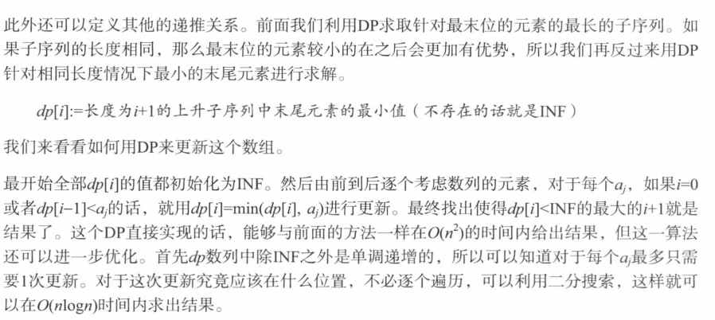

实现过程如下：

```c++
#define MAX_N 1010
#define INF 10010
int main()
{
    int i;
    int n;
    cin>>n;
    int a[1010];
    
    for(i=0;i<n;i++)
    {
        cin>>a[i];
    }
    int dp[MAX_N];
    fill(dp,dp+n,INF);
    for(i=0;i<n;i++)
    {
        *lower_bound(dp,dp+n,a[i])=a[i];
    }
    cout<<lower_bound(dp,dp+n,INF)-dp<<endl;
} 
```

### 6.最大子段和

给定n个整数组成的序列 `a1,a2,…,an` ，求该序列子段和的最大值。最大子段和不能是负数，当序列中均为负数时定义最大子段和为0。例如 `{-2, 11, -4, 13, -5, -2}` 的最大子段和为 `20` 。首先可以想到用分治的方法解决这个问题，如果将给定的序列 `a[1..n]` 分成长度相等的两段 `a[1..n/2]` 和 `a[n/2+1:n]` ，分别求出这两段的最大子段和。则该给定序列的最大子段和有三种情况：

- 和 `a[1…n/2]` 的最大子段和相同；
- 和 `a[n/2+1…n]` 的最大子段和相同；
- 最大子段和包含两部分。

前两种情形我们可以用递归方法求出，第三种情形可以分别求出两部分的最大子段和值再相加。序列的最大子段和即为这三种情形的最大值。

实现过程如下：

```c++
int maxsub(int a[],int low,int high)
{
    if(low==high) return a[low];
    int s1,s2,s3,s31,s32,i,j,sum;
    int mid=(low+high)/2;
    s1=maxsub(a,low,mid);
    s2=maxsub(a,mid+1,high);
    i=mid;
    s31=a[mid];
    while((s31+a[i-1]>s31)&&(i>low))
    {
        s31+=a[i-1];
        i--;
    }
    j=mid+1;
    s32=a[mid+1];
    while((s32+a[j+1]>s32)&&(j<high))
    {
        s32+=a[j+1];
        j++;
    }
    sum=s31+s32;
    if(sum<s1) sum=s1;
    if(sum<s2) sum=s2; 
    return sum;
}

int main()
{
    int a[6]={-2,11,-4,13,-5,-2};
    cout<<max(0,maxsub(a,0,5))<<endl;
}
```

使用动态规划的解法能够获得更好的复杂度。若记 `b[j]=max(a[i]+a[i+1]+..+a[j])` ，其中 `1<=i<=j` ，并且 `1<=j<=n` 。注意一点， `b[j]` 一定包括了 `a[j]` 。所求的最大子段和为 `max b[j]` ， `1<=j<=n` 。由 `b[j]` 的定义可易知，当 `b[j-1]>0` 时 `b[j]=b[j-1]+a[j]` ，否则 `b[j]=a[j]` 。故 `b[j]` 的动态规划递归式为： `b[j]=max(b[j-1]+a[j],a[j])` ， `1<=j<=n` 。

```c++
int maxsub(int a[],int n)       
{
    int sum=0,b=0;
    for(int i=0;i<=n;i++) 
    {
        if(b>0) b+=a[i];
          else b=a[i];
        if(b>sum) sum=b;
      }
    return sum;
}

int main()
{
    int a[6]={-2,11,-4,13,-5,-2};
    cout<<maxsub(a,5)<<endl;
}
```

#### 7.最大子矩阵和

求一个最大为 `100*100` 矩阵中的子矩阵中元素之和的最大值

主要思想为将其转化为一维数组求最大子段和，如果最优解左起第i列，右止于第j列，那么我们相当于把这些列的对应位加和，成为一列，并对改列求最大子段和即可（降维思想）。

实现过程如下：

```c++
#define maxn 105
#define inf 0x3f3f3f3f

int array[maxn][maxn];
int f[maxn][maxn][maxn];

int main()
{
    int n;cin>>n;
    for(int i=1;i<=n;i++)
    {
        for(int j=1;j<=n;j++){scanf("%d", &array[i][j]);}
    }
    memset(f, 0, sizeof(f));
    int ans=-inf;
    for(int i=1;i<=n;i++)
    {
        for(int j=1;j<=n;j++)
        {
            int sum=0;
            for(int k=j;k<=n;k++)
            {
                sum+=array[i][k];
                f[i][j][k]=max(f[i-1][j][k]+sum,sum);//i是指行，j是起始列，k是终结列，f存的值为在ijk范围内的元素和最大值
                ans=max(ans,f[i][j][k]);
            }
        }
    }
    cout<<ans<<endl;
    return 0;
}
```

#### 8.凸多边形最优三角剖分

用多边形顶点的逆时针序列表示凸多边形，即 `P={V0,V1,…,Vn}` 表示具有 `n+1` 条边的凸多边形。给定凸多边形 `P` ，以及定义在由多边形的边和弦组成的三角形上的权函数 `w` 。要求确定该凸多边形的三角剖分，使得即该三角剖分中诸三角形上权之和为最小。若 `P={V0,V1……Vn}` 的最优三角剖分T包含三角形 `V0VkVn` ，则 `T` 的权为三个部分权之和：三角形 `V0VkVn` 的权，多边形 `{V0,V1……Vk}` 的权和多边形 `{Vk,Vk+1……Vn}` 的权之和。可以断言，由 `T` 确定的这两个子多边形的三角剖分也是最优的。设 `t[i][j]` 为凸多边形 `{Vi-1,Vi……Vj}` 的最优三角剖分所对应的最优权值，则 `P` 的最优权值为 `t[1][n]` ，有：
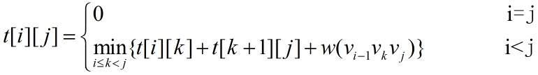

实现过程如下：

```c++
#define N 6 
int weight[][N]= 
{
{0,2,2,3,1,4},
{2,0,1,5,2,3},
{2,1,0,2,1,4},
{3,5,2,0,6,2},
{1,2,1,6,0,1},
{4,3,4,2,1,0}
};
int t[N][N];    //t[i][j]表示多边形{Vi-1VkVj}的最优权值
int s[N][N];    //s[i][j]记录Vi-1到Vj最优三角剖分的中间点K

int get_weight(const int a, const int b, const int c)
{
    return weight[a][b]+weight[b][c]+weight[c][a];
}

void minweight()
{
    int minval;
    for(int i=1;i<N;i++) t[i][i]=0;
    for(int r=2;r<N;r++)
    {
        for(int i=1;i<N-r+1;i++)
        {
            int j=i+r-1;
            minval=9999;     
            for (int k=i;k<j;k++)
            {
                t[i][j]=t[i][k]+t[k+1][j]+get_weight(i-1,k,j);
                if(t[i][j]<minval)       
                {
                    minval=t[i][j];
                    s[i][j]=k;    
                }
            }
            t[i][j]=minval;        
            //取得多边形Vi-1Vj的最小划分权值
        }
    }
}

void backtrack(int a, int b)
{
    if (a==b) return;
    backtrack(a,s[a][b]);
    backtrack(s[a][b]+1,b);    
    cout<<"最优三角:"<<"v"<<a-1<<"v"<<s[a][b]<<"v"<<b<<endl;
}

int main()
{
    minweight();
    cout<<"result:"<<t[1][N-1]<<endl;
    backtrack(1,5);
}
```

#### 9.最优二叉搜索树

在《算法导论》中对于这个问题有详细的描述。如果在二叉树中查找元素不考虑概率及查找不成功的情况下，可以采用红黑树或者平衡二叉树来搜索。而现实生活中，查找的关键字是有一定的概率的，就是说有的关键字可能经常被搜索，而有的很少被搜索，而且搜索的关键字可能不存在，为此需要根据关键字出现的概率构建一个二叉树。比如输入法中针对用户习惯可以自动调整词频以减少用户翻查次数，使得经常用的词汇被放置在前面，这样就能有效地加快查找速度。给定一个由n个互异的关键字组成的有序序列 `K={k1<k2<k3<,……,<kn}` 和它们被查询的概率 `P={p1,p2,p3,……,pn}` ，构造一棵二叉查找树使得查询所有元素的总的代价最小。对于一个搜索树，当搜索的元素在树内时，表示搜索成功。当不在树内时，表示搜索失败，用一个虚叶子节点来标示搜索失败的情况，因此需要 `n+1` 个虚叶子节点 `{d0<d1<……<dn}` ，对于应di的概率序列是 `Q={q0,q1,……,qn}` 。其中 `d0` 表示搜索元素小于 `k1` ， `dn` 表示搜索元素大于 `kn` 。 `di(0<i<n)` 表示搜索节点在 `ki` 和 `k(i+1)` 之间。因此有公式：


由每个关键字和每个虚拟键被搜索的概率，可以确定在一棵给定的二叉查找树内一次搜索的期望代价。设一次搜索的实际代价为检查的节点个数，即所发现的节点的深度加上 `1` 。所以一次搜索的期望代价为：


需要注意的是一棵最优二叉查找树不一定是一棵整体高度最小的树，也不一定总是把最大概率的关键字放在根部。对于这一点可以很容易找到反例。定义 `e[i,j]` 为搜索一棵包含关键字 `ki，……，kj` 的最优二叉查找树的期望代价，当 `j=i-1` 时，说明此时只有虚拟键di-1，故 `e[i,i-1] = qi-1` ；当 `j≥i` 时，需要从 `ki，……，kj` 中选择一个根 `kr` ，然后用关键字 `ki，……，kr-1` 来构造一棵最优二叉查找树作为左子树，用关键字 `kr+1，……，kj` 来构造一棵最优二叉查找树作为右子树。定义一棵有关键字 `ki，……，kj` 的子树概率的总和为：


当一棵树成为一个节点的子树时子树中每个节点深度都增加1，期望搜索代价增加量为子树中所有节点概率的总和。因此如果kr是一棵包含关键字ki，……，kj的最优子树的根，则有：

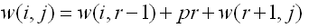


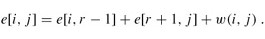


用 `root[i,j]` 来记录关键字 `ki，……，kj` 的子树的根，另外为了防止重复计算，用二维数组来保存 `w(i,j)` 的值，其中 `w[i,j] = w[i,j-1]+pj+qj` 。

实现过程如下：

```c++
#define N 5
#define MAX 999999.99999
void optimal_binary_search_tree(float *p,float *q,int n,float e[N+2][N+1],int root[N+1][N+1]);
void Construct_Optimal_BST(int root[N+1][N+1],int i,int j,bool flag);
 
int main()
{
    float p[N+1]={0,0.15,0.10,0.05,0.10,0.20};
     float q[N+1]={0.05,0.10,0.05,0.05,0.05,0.10};
      float e[N+2][N+1];
       int root[N+1][N+1];
       int i,j;
    optimal_binary_search_tree(p,q,N,e,root);
    cout<<"最优二叉查找树的代价为: "<<e[1][N]<<endl;
    cout<<"最优二叉查找树的结构描述如下："<<endl;
    Construct_Optimal_BST(root,1,N,0);
}
 
void optimal_binary_search_tree(float *p,float *q,int n,float e[N+2][N+1],int root[N+1][N+1])
{
    int i,j,k,r;
     float t;
      float w[N+2][N+1];
    for(i=1;i<=N+1;++i) 
       {
           e[i][i-1]=q[i-1];
         w[i][i-1]=q[i-1];
       }
    for(k=1;k<=n;++k) 
     //自底向上寻找最优子树
    {
         for(i=1;i<=n-k+1;i++)
           {
               j=i+k-1;
               e[i][j]=MAX;
             w[i][j]=w[i][j-1]+p[j]+q[j];
              for(r=i;r<=j;r++) 
               {
                   t=e[i][r-1]+e[r+1][j]+w[i][j];
                   if(t<e[i][j])
                  {
                      e[i][j]=t;
                     root[i][j]=r;
                   }
               }
           }
     }
}

void Construct_Optimal_BST(int root[N+1][N+1],int i,int j,bool flag)  
{  
    if(flag==0)  
    {  
        cout<<"k"<<root[i][j]<<" is root"<<endl;  
        flag=1;  
    }  
    int r=root[i][j];  
    //如果左子树是叶子  
    if(r-1<i)  
    {  
        cout<<"d"<<r-1<<" is the left child of "<<"K"<<r<<endl;  
    }  
    //如果左子树不是叶子  
    else  
    {  
        cout<<"k"<<root[i][r-1]<<" is the left child of "<<"K"<<r<<endl;  
        Construct_Optimal_BST(root,i,r-1,1);  
    }  
    //如果右子树是叶子  
    if(r+1>j)  
    {  
        cout<<"d"<<j<<" is the right child of "<<"K"<<r<<endl;  
    }  
    //如果右子树不是叶子  
    else  
     {  
        cout<<"k"<<root[r+1][j]<<" is the right child of "<<"K"<<r<<endl;  
        Construct_Optimal_BST(root,r+1,j,1);  
    }  
}
```

#### 10.双调欧几里得旅行商问题

这个问题是《算法导论》中的思考题。给定平面上n个点，确定一条连接各点的最短闭合旅程。这个解的一般形式为NP的。J.L. Bentley建议通过只考虑双调旅程来简化问题。这种旅程即为从最左点开始，严格地从左到右直至最右点，然后严格地从右到左直至出发点。在这种情况下，存在确定的最优双调路线的O(n*n)时间的算法。

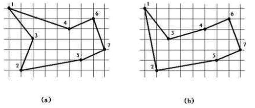

例如， `a` 图是最短闭合路线，但是它不是双调的。 `b` 图是最短的闭合双调路线。
首先将各点按照x坐标从小到大排列，定义从 `Pi` 到 `Pj` 的路径为从 `Pi` 开始，从右到左一直到 `P1` ，然后从左到右一直到 `Pj` 。在这个路径上，会经过 `P1` 到 `Pmax(i,j)` 之间的所有点且每个点只经过一次。定义 `d(i,j)` 为满足这一条件的最短路径，我们只考虑 `i>=j` 的情况。同时定义 `dist(i,j)` 为点 `Pi` 到 `Pj` 之间的直线距离。根据题意我们需要求的是 `d(n,n)` 。
关于子问题 `d(i,j)` 的求解，分三种情况：
当 `j<i-1` 时，由定义可知，点 `Pi-1` 一定在路径 `Pi-Pj` 上，又由于 `j<i-1` ，因此 `Pi` 的左边的相邻点一定是 `Pi-1` ，故 `d(i,j)=d(i-1,j)+dist(i-1,i)` 。
当 `j=i-1` 时，与 `Pi` 相邻的那个点可能是 `P1` 到 `Pi-1` 中的任何一个，故 `d(i,i-1)=min{d(k,i-1)+dist(i,k)}` ， `1<=k<i-1` 。
当 `j=i` 时，同理， `d(i,i)=min{d(k,i)+dist(i,k)}` ， `1<=k<i` 。

实现过程如下：

```c++
#define INF 0x3f3f3f3f    
int n;  
double dis[550][550],dp[505][505];  
struct Node
{  
    int x,y;  
}node[1500];
  
bool cmp(Node a,Node b)
{  
    if(a.x!=b.x) return a.x<b.x;  
    else return a.y<b.y;  
}  

void get_dis()
{  
    int x1,x2,y1,y2;  
    for(int i=1;i<=n;++i)
    {  
        x1=node[i].x;
        y1=node[i].y;  
        for(int j=i;j<=n;++j)
        {  
            x2=node[j].x;
            y2=node[j].y;  
            dis[j][i]=dis[i][j]=sqrt((double)((x1-x2)*(x1-x2)+(y1-y2)*(y1-y2)));  
        }  
    }  
}  

int main()  
{  
    int x,y;  
    while(scanf("%d",&n)!=EOF)
    {  
        memset(dis,0,sizeof(dis));  
        for(int i=1;i<=n;++i)
        {  
            scanf("%d%d",&x,&y);  
            node[i]=(Node){x,y};  
        }  
        sort(node+1,node+n+1,cmp);  
        get_dis();  
        dp[2][1]=dp[1][2]=dis[1][2];  
        dp[2][2]=2*dis[1][2];  
        for(int i=3;i<=n;++i)
        {  
            for(int j=1;j<i-1;++j)
            {  
                dp[j][i]=dp[i][j]=dp[i-1][j]+dis[i][i-1];  
            }  
            dp[i][i-1]=dp[i-1][i]=dp[i][i]=INF;  
            for(int k=1;k<i-1;++k)
            {  
                if(dp[i][i-1]-(dp[k][i-1]+dis[k][i])>1e-3)
                {  
                    dp[i-1][i]=dp[i][i-1]=dp[k][i-1]+dis[k][i];  
                }  
            }  
            for(int k=1;k<i;++k)
            {  
                if(dp[i][i]-(dp[k][i]+dis[k][i])>1e-3)
                {  
                    dp[i][i]=dp[k][i]+dis[k][i];  
                }  
            }  
        }  
        printf("%.2f\n",dp[n][n]);  
    }  
    return 0;  
}
```

#### 11.最大不相交子段和

求两个不相交子段加起来的最大值。

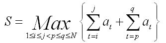

将数组a[]从下标k处划分成两部分 `a[1-k]` 和 `a[k+1,N]` ，用 `m1` 表示 `a[1-k]` 的最大字段和， `m2` 表示 `a[k+1,N]` 的最大字段和，则 `S = Max { m1, m2 } ` ( 其中 `k` 属于区间 `[2-N-1] ` ， `k` 不能取 `1` 和 `N` ，因为题目中 `j<p` )

通过正向遍历数组 `a` 求 `m1` ，逆向遍历数组 `a` 求 `m2` ，最后根据  `S = Max { m1,m2 }` 枚举 `k` 即可。

```c++
const int INF = -0xfffffff;
const int Max = 100000;

// 对象
int n;
int a[Max+1];
int b[Max+2];
int m1[Max+2], m2[Max+2]; // m1[i]:Max sum of sub array [0,i] of a
                          // m2[i]:Max sum of sub array [i,n] of a
int maxSum; // res


int main()
{
    while( scanf( "%d", &n ) && n ) {
        m1[0] = m2[n+1] = INF;
        memset( b, 0, sizeof(b) );
        for( int i = 1; i <= n; ++ i ) {
            scanf( "%d", &a[i] );
            if( b[i-1] >= 0 )
                b[i] = b[i-1] + a[i];
            else 
                b[i] = a[i];
            m1[i] = b[i] > m1[i-1] ? b[i] : m1[i-1];
        }

        for( int i = n; i >= 1; -- i ) {
            if( b[i+1] >= 0 )
                b[i] = b[i+1] + a[i];
            else
                b[i] = a[i];
            m2[i] = b[i] > m2[i+1] ? b[i] : m2[i+1];
        }

        maxSum = INF;
        for( int i = 1; i < n; ++ i ) {
            if( m1[i] + m2[i+1] > maxSum )
                maxSum = m1[i] + m2[i+1];
        }
        printf( "%d\n", maxSum );
    }
    return 0;
}
```

#### 12.最长回文子串

回文是指正着读和倒着读，结果一些样，比如 `abcba` 或 `abba` 。

举个例子，我们要在一个字符串中要到最长的回文子串。

**暴力求解：**

最容易想到的就是暴力破解，求出每一个子串，之后判断是不是回文，找到最长的那个。

求每一个子串时间复杂度 `O(N^2)` ，判断子串是不是回文 `O(N)` ，两者是相乘关系，所以时间复杂度为 `O(N^3)` 。

```c++
string findLongestPalindrome(string &s)
{
    int length=s.size();//字符串长度
    int maxlength=0;//最长回文字符串长度
    int start;//最长回文字符串起始地址
    for(int i=0;i<length;i++)//起始地址
        for(int j=i+1;j<length;j++)//结束地址
        {
            int tmp1,tmp2;
            for(tmp1=i,tmp2=j;tmp1<tmp2;tmp1++,tmp2--)//判断是不是回文
            {
                if(s.at(tmp1)!=s.at(tmp2))
                    break;
            }
            if(tmp1>=tmp2&&j-i>maxlength)
            {
                maxlength=j-i+1;
                start=i;
            }
        }
        if(maxlength>0)
            return s.substr(start,maxlength);//求子串
        return NULL;
}
```

**动态规划**

回文字符串的子串也是回文，比如 `P[i,j]` （表示以 `i` 开始以 `j` 结束的子串）是回文字符串，那么 `P[i+1,j-1]` 也是回文字符串。这样最长回文子串就能分解成一系列子问题了。这样需要额外的空间 `O(N^2)` ，算法复杂度也是 `O(N^2)` 。

首先定义状态方程和转移方程：

`P[i,j]=0` 表示子串 `[i,j]` 不是回文串。 `P[i,j]=1` 表示子串 `[i,j]` 是回文串。

```c++
string findLongestPalindrome(string &s)
{
    const int length=s.size();
    int maxlength=0;
    int start;
    bool P[50][50]={false};
    for(int i=0;i<length;i++)//初始化准备
    {
        P[i][i]=true;
        if(i<length-1&&s.at(i)==s.at(i+1))
        {
            P[i][i+1]=true;
            start=i;
            maxlength=2;
        }
    }
    for(int len=3;len<=length;len++)//子串长度
        for(int i=0;i<=length-len;i++)//子串起始地址
        {
            int j=i+len-1;//子串结束地址
            if(P[i+1][j-1]&&s.at(i)==s.at(j))
            {
                P[i][j]=true;
                maxlength=len;
                start=i;
            }
        }
    if(maxlength>=2)
        return s.substr(start,maxlength);
    return NULL;
}
```

**中心扩展**

中心扩展就是把给定的字符串的每一个字母当做中心，向两边扩展，这样来找最长的子回文串。算法复杂度为 `O(N^2)` 。

但是要考虑两种情况：

1、像 `aba` ，这样长度为奇数。

2、像 `abba` ，这样长度为偶数。

实现过程如下：

```c++
string findLongestPalindrome(string &s)
{
    const int length=s.size();
    int maxlength=0;
    int start;

    for(int i=0;i<length;i++)//长度为奇数
    {
        int j=i-1,k=i+1;
        while(j>=0&&k<length&&s.at(j)==s.at(k))
        {
            if(k-j+1>maxlength)
            {
                maxlength=k-j+1;
                start=j;
            }
            j--;
            k++;
        }
    }

    for(int i=0;i<length;i++)//长度为偶数
    {
        int j=i,k=i+1;
        while(j>=0&&k<length&&s.at(j)==s.at(k))
        {
            if(k-j+1>maxlength)
            {
                maxlength=k-j+1;
                start=j;
            }
            j--;
            k++;
        }
    }
    if(maxlength>0)
        return s.substr(start,maxlength);
    return NULL;
}
```

**Manacher法**

`Manacher` 法只能解决例如 `aba` 这样长度为奇数的回文串，对于 `abba` 这样的不能解决，于是就在里面添加特殊字符。我是添加了 `“#”` ，使 `abba` 变为 `a#b#b#a` 。这个算法就是利用已有回文串的对称性来计算的，具体算法复杂度为 `O(N)` ，我没看出来，因为有两个嵌套的 `for` 循环。

具体原理利用已知回文串的左半部分来推导右半部分

首先,在字符串 `s` 中,用 `rad[i]` 表示第i个字符的回文半径,即 `rad[i]` 尽可能大,且满足:
 `s[i-rad[i],i-1]=s[i+1,i+rad[i]]` 
很明显,求出了所有的rad,就求出了所有的长度为奇数的回文子串.
至于偶数的怎么求,最后再讲.
假设现在求出了 `rad[1..i-1]` ，现在要求后面的 `rad` 值,并且通过前面的操作,得知了当前字符 `i` 的 `rad` 值至少为j.现在通过试图扩大 `j` 来扫描,求出了 `rad[i]` 。再假设现在有个指针 `k` ，从1循环到 `rad[i]` ，试图通过某些手段来求出 `[i+1,i+rad[i]]` 的 `rad` 值.
根据定义,黑色的部分是一个回文子串,两段红色的区间全等.
因为之前已经求出了 `rad[i-k]` ，所以直接用它。有 `3` 种情况:

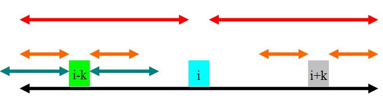

① `rad[i]-k<rad[i-k]`

如图， `rad[i-k]` 的范围为青色.因为黑色的部分是回文的,且青色的部分超过了黑色的部分,所以 `rad[i+k]` 肯定至少为 `rad[i]-k` ，即橙色的部分.那橙色以外的部分就不是了吗?这是肯定的.因为如果橙色以外的部分也是回文的,那么根据青色和红色部分的关系,可以证明黑色部分再往外延伸一点也是一个回文子串,这肯定不可能,因此 `rad[i+k]=rad[i]-k` 。为了方便下文,这里的 `rad[i+k]=rad[i]-k=min(rad[i]-k,rad[i-k])` 。

 

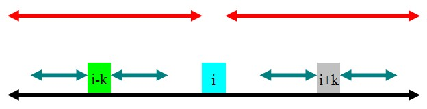

②rad[i]-k>rad[i-k]
如图,rad[i-k]的范围为青色.因为黑色的部分是回文的,且青色的部分在黑色的部分里面,根据定义,很容易得出:rad[i+k]=rad[i-k].为了方便下文,这里的rad[i+k]=rad[i-k]=min(rad[i]-k,rad[i-k]).

根据上面两种情况,可以得出结论:当rad[i]-k!=rad[i-k]的时候,rad[i+k]=min(rad[i]-k,rad[i-k]).
注意:当rad[i]-k==rad[i-k]的时候,就不同了,这是第三种情况:

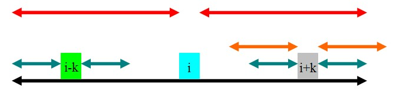

如图,通过和第一种情况对比之后会发现,因为青色的部分没有超出黑色的部分,所以即使橙色的部分全等,也无法像第一种情况一样引出矛盾,因此橙色的部分是有可能全等的,但是,根据已知的信息,我们不知道橙色的部分是多长，因此就把 `i` 指针移到 `i+k` 的位置， `j=rad[i-k]` (因为它的 `rad` 值至少为 `rad[i-k]` )，等下次循环的时候再做了.
整个算法就这样，至于时间复杂度为什么是 `O(n)` ,我已经证明了,但很难说清楚，所以自己体会吧.
上文还留有一个问题,就是这样只能算出奇数长度的回文子串,偶数的就不行.怎么办呢?有一种直接但比较笨的方法,就是做两遍(因为两个程序是差不多的,只是 `rad` 值的意义和一些下标变了而已).但是写两个差不多的程序是很痛苦的,而且容易错.所以一种比较好的方法就是在原来的串中每两个字符之间加入一个特殊字符,再做.如: `aabbaca` ,把它变成 `(#a#a#b#b#a#c#a#)` ，左右的括号是为了使得算法不至于越界。这样的话,无论原来的回文子串长度是偶数还是奇数,现在都变成奇数了.

测试代码中我没过滤掉 `“#”` 。

```c++
#define min(x, y) ((x)<(y)?(x):(y))
#define max(x, y) ((x)<(y)?(y):(x))
string findLongestPalindrome3(string s)
{
    int length=s.size();
    for(int i=0,k=1;i<length-1;i++)//给字符串添加 #
    {
        s.insert(k,"#");
        k=k+2;
    }
    length=length*2-1;//添加#后字符串长度
    int *rad=new int[length]();
    rad[0]=0;
    for(int i=1,j=1,k;i<length;i=i+k)
    {
        while(i-j>=0&&i+j<length&&s.at(i-j)==s.at(i+j))
            j++;
        rad[i]=j-1;
        for(k=1;k<=rad[i]&&rad[i-k]!=rad[i]-k;k++)//镜像,遇到rad[i-k]=rad[i]-k停止，这时不用从j=1开始比较
            rad[i+k]=min(rad[i-k],rad[i]-k);

        j=max(j-k,0);//更新j
        
    }
    int max=0;
    int center;
    for(int i=0;i<length;i++)
    {
        if(rad[i]>max)
        {
            max=rad[i];
            center=i;
        }
    }
    return s.substr(center-max,2*max+1);

}
```

#### 13.KMP算法

KMP算法用于字符串匹配， `kmp` 算法完成的任务是：给定两个字符串 `O` 和 `f` ，长度分别为 `n` 和 `m` ，判断f是否在O中出现，如果出现则返回出现的位置。常规方法是遍历a的每一个位置，然后从该位置开始和 `b` 进行匹配，但是这种方法的复杂度是 `O(nm)` 。 `kmp` 算法通过一个 `O(m)` 的预处理，使匹配的复杂度降为 `O(n+m)` 。

在这里我只能简单的进行个小结，有兴趣的同学可以参考我之前写过的一篇文章[KMP算法学习(详解)](http://www.cnblogs.com/ECJTUACM-873284962/p/6751457.html)

朴素匹配算法需要两个指针i，j都遍历一遍字符串，故复杂度 `m*n` 

`KMP` 算法 `i` 指针不回溯，j指针的回溯参考 `next` 数组，体现了动态规划的思想

原理如下：

蓝色表示匹配，红色为失配

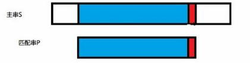

分析蓝色部分

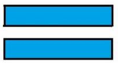

如果存在最长公共前后缀的话，比如这样：

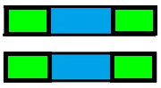

就可以在下次匹配的时候用，这样避免了i的回溯

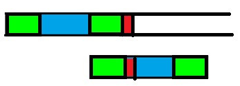

`next` 数组的意义：当模式匹配串T失效的时候， `next` 数组对应的元素知道应该使用 `T` 串的哪个元素进行下一轮匹配

实现过程如下：

```c++
void get_next(string T, int *next)
{
    int i = 1;    //后缀
    int j = 0;    //前缀
    next[1] = 0;
    while (i < T[0])    //T[0]表示字符串长度
    {
        if (j == 0 || T[i] == T[j])
        {
            i++;
            j++;
            next[i] = j;
        }
        else
            j = next[j];
    }
}

int KMP(string S, string T, int pos)
{
    int i = pos;    //标记主串S下标
    int j = 1;        //匹配串下标
    int next[255];
    get_next(T, next);
    while (i <= S[0] && j <= T[0])    //0位置都放字符串长度
    {
        if (j == 0 || S[i] == T[j])
        {
            i++;
            j++;
        }
        else
            j = next[j];    //j退回到合适位置，i不用再回溯了
        if (j > T[0])    //如果存在j在匹配完最后一个元素后又++了，所以会大于长度
            return i - T[0];    //i的位置减去匹配串的长度就是匹配串出现的位置
        else
            return 0;
    }
}
```

会出现一种特殊情况：

`S = “aaaabcde”` 

`T = "aaaaax"`

这样的话 `next` 数组为 `012345` ，实际上由于前面都是 `a` ，直接调到第一个 `a` 就可以了，期望的 `next` 数组为 `000005`

这样 `next` 数组构造改为 `12-15` 行

改进方案：

```c++
void get_next(string T, int *next)
{
    int i = 1;    //后缀
    int j = 0;    //前缀
    next[1] = 0;
    while (i < T[0])    //T[0]表示字符串长度
    {
        if (j == 0 || T[i] == T[j])
        {
            i++;
            j++;
            if (T[i] != T[j])
                next[i] = j;
            else
                next[i] = next[j];
        }
        else
            j = next[j];
    }
}
```

#### 14.硬币找零问题

假设有几种硬币，如 `1 5 10 20 50 100` ，并且数量无限。请找出能够组成某个数目的找零所使用最少的硬币数。

解法：

用待找零的数值 `k` 描述子结构/状态，记作 `sum[k]` ，其值为所需的最小硬币数。对于不同的硬币面值 `coin[0...n]` ，有 `sum[k] = min(sum[k-coin[0]]`  ,  `sum[k-coin[1]], ...)+1` 。对应于给定数目的找零 `total` ，需要求解 `sum[total]` 的值。

注意要从前往后算，从后往前算无法保存状态，需要递归，效率很低，就不是动态规划了

```c++
#define MaxNum  pow(2,31) - 1
int main()
{
    int n;
    while (cin >> n)
    {
        vector<int> c(n + 1, 0);
        for (int i = 1; i <= n; i++)
        {
            if (i == 1 || i == 5 || i == 10 || i == 20 || i == 50 || i == 100)
            {
                c[i] = 1;
                continue;
            }
            int curMin = MaxNum;
            if (i - 1 > 0)
                curMin = c[i - 1] < curMin ? c[i - 1] : curMin;
            if (i - 5 > 0)
                curMin = c[i - 5] < curMin ? c[i - 5] : curMin;
            if (i - 10 > 0)
                curMin = c[i - 10] < curMin ? c[i - 10] : curMin;
            if (i - 20 > 0)
                curMin = c[i - 20] < curMin ? c[i - 20] : curMin;
            if (i - 50 > 0)
                curMin = c[i - 50] < curMin ? c[i - 50] : curMin;
            if (i - 100 > 0)
                curMin = c[i - 100] < curMin ? c[i - 100] : curMin;
            c[i] = curMin + 1;
        }
        cout << c[n] << endl;
    }
    system("pause");
    return 0;
}
```

#### 15.找平方个数最小

给一个正整数 `n` , 找到若干个完全平方数(比如 `1, 4, 9, ... ` )使得他们的和等于 `n` 。你需要让平方数的个数最少。
给出 `n = 12` , 返回 `3` 因为 `12 = 4 + 4 + 4` 。
给出 `n = 13`， 返回 `2` 因为 `13 = 4 + 9`。

实现过程如下：

```c++
int findMin(int n)
{
    int *result = new int(n + 1);
    result[0] = 0;
    for (int i = 1; i <= n; i++)
    {
        int minNum = i;
        for (int j = 1;; j++)
        {
            if (i >= j * j)
            {
                int tmp = result[i - j*j] + 1;
                minNum = tmp < minNum ? tmp : minNum;
            }
            else
                break;
        }
        result[i] = minNum;
    }
    return result[n];
}

int main()
{
    int n;
    while (cin >> n)
        cout << findMin(n) << endl;
}
```

#### 16.N*N方格内的走法问题

有一个 `n*n` 的方格，从左上角走到右下角有多少种最短路径的走法？

若不加最短路径则 `n^(n-1)` 种走法。加上了最短路径就是说横向的距离为 `n-1` ，纵向的距离为 `n-1` ，总共的距离是 `2(n-1)` 步走到。

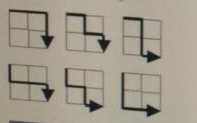

实现过程如下：

```c++
int main()
{
    int n;
    while (cin >> n)
    {
        vector<vector<int>> dp(n+1, vector<int>(n+1, 1));
        for (int i = 1; i <= n;i++)
        {
            for (int j = 1; j <= n;j++)
            {
                dp[i][j] = dp[i][j - 1] + dp[i - 1][j];
            }
        }
        cout << dp[n][n] << endl;
    }
}
```

#### 17.楼层抛珠问题

某幢大楼有 `100` 层。你手里有两颗一模一样的玻璃珠。当你拿着玻璃珠在某一层往下扔的时候，一定会有两个结果，玻璃珠碎了或者没碎。这幢大楼有个临界楼层。低于它的楼层，往下扔玻璃珠，玻璃珠不会碎，等于或高于它的楼层，扔下玻璃珠，玻璃珠一定会碎。玻璃珠碎了就不能再扔。现在让你设计一种方式，使得在该方式下，最坏的情况扔的次数比其他任何方式最坏的次数都少。也就是设计一种最有效的方式。

例如：有这样一种方式，第一次选择在 `60` 层扔，若碎了，说明临界点在 `60` 层及以下楼层，这时只有一颗珠子，剩下的只能是从第一层，一层一层往上实验，最坏的情况，要实验 `59` 次，加上之前的第一次，一共 `60` 次。若没碎，则只要从 `61` 层往上试即可，最多只要试 `40` 次，加上之前一共需 `41` 次。两种情况取最多的那种。故这种方式最坏的情况要试 `60` 次。仔细分析一下。如果不碎，我还有两颗珠子，第二颗珠子会从 `N+1` 层开始试吗？很显然不会，此时大楼还剩 `100-N` 层，问题就转化为 `100-N` 的问题了。

那该如何设计方式呢？

根据题意很容易写出状态转移方程：`N` 层楼如果从 `n` 层投下玻璃珠，最坏的尝试次数是：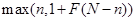

那么所有层投下的最坏尝试次数的最小值即为问题的解：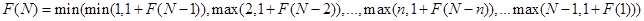。其中 `F(1)=1` 。

实现过程如下：

```c++
int max(int a, int b)
{
    return (a > b)? a : b;
}

int dp[101];
//N<=100;
int floorThr(int N)
{
    for (int i = 2; i <= N; i++)
    {
        dp[i] = i;
        for (int j = 1; j<i; j++)
        {
            int tmp = max(j, 1 + dp[i - j]);    //j的遍历相当于把每层都试一遍
            if (tmp<dp[i])
                dp[i] = tmp;
        }
    }
    return dp[N];
}

int main()
{
    dp[0] = 0;
    dp[1] = 1;
    int dis = floorThr(100);
    cout << dis << endl;
    system("Pause");
}
```

#### 18.字符串相似度/编辑距离(edit distance)

许多程序会大量使用字符串。对于不同的字符串，我们希望能够有办法判断其相似程度。我们定义了一套操作方法来把两个不相同的字符串变得相同，具体的操作方法为：
1.修改一个字符（如把 `“a”` 替换为 `“b”` ）。
2.增加一个字符（如把 `“abdd”` 变为 `“aebdd”` ）。
3.删除一个字符（如把 `“travelling”` 变为 `“traveling”` ）。
比如，对于 `“abcdefg”` 和 `“abcdef”` 两个字符串来说，我们认为可以通过增加/减少一个 `“g“` 的方式来达到目的。上面的两种方案，都仅需要一次操作。把这个操作所需要的次数定义为两个字符串的距离，给定任意两个字符串，你是否能写出一个算法来计算出它们的距离？

不难看出，两个字符串的距离肯定不超过它们的长度之和（我们可以通过删除操作把两个串都转化为空串）。虽然这个结论对结果没有帮助，但至少可以知道，任意两个字符串的距离都是有限的。
我们还是应该集中考虑如何才能把这个问题转化成规模较小的同样的问题。如果有两个串 `A=xabcdae` 和 `B=xfdfa` ，它们的第一个字符是相同的，只要计算 `A[2,…,7]=abcdae` 和 `B[2,…,5]=fdfa` 的距离就可以了。但是如果两个串的第一个字符不相同，那么可以进行如下的操作（ `lenA` 和 `lenB` 分别是 `A` 串和 `B` 串的长度）：
1．删除 `A` 串的第一个字符，然后计算 `A[2,…,lenA]` 和 `B[1,…,lenB]` 的距离。
2．删除 `B` 串的第一个字符，然后计算 `A[1,…,lenA]` 和 `B[2,…,lenB]` 的距离。
3．修改 `A` 串的第一个字符为B串的第一个字符，然后计算 `A[2,…,lenA]` 和 `B[2,…,lenB]` 的距离。
4．修改 `B` 串的第一个字符为A串的第一个字符，然后计算 `A[2,…,lenA]` 和 `B[2,…,lenB]` 的距离。
5．增加 `B` 串的第一个字符到A串的第一个字符之前，然后计算 `A[1,…,lenA]` 和 `B[2,…,lenB]` 的距离。
6．增加 `A` 串的第一个字符到B串的第一个字符之前，然后计算 `A[2,…,lenA]` 和 `B[1,…,lenB]` 的距离。

在这个题目中，我们并不在乎两个字符串变得相等之后的字符串是怎样的。所以，可以将上面 `6` 个操作合并为：
1.一步操作之后，再将 `A[2,…,lenA]` 和 `B[1,…,lenB]` 变成相同字符串。
2.一步操作之后，再将 `A[1,…,lenA]` 和 `B[2,…,lenB]` 变成相同字符串。
3.一步操作之后，再将 `A[2,…,lenA]` 和 `B[2,…,lenB]` 变成相同字符串。

这样，很快就可以完成一个递归程序。

代码实现如下：

```c++
int calStringDis(string strA, int pABegin,int pAEnd,string strB, int pBBegin,int pBEnd)  
{    
    if (pABegin > pAEnd)    
    {    
        if (pBBegin > pBEnd)    
            return 0;     
        else    
            return pBEnd - pBBegin + 1;    
    }    
    if (pBBegin > pBEnd)    
    {    
        if(pABegin > pAEnd)    
            return 0;    
        else    
            return pAEnd - pABegin + 1;    
    }    
    if (strA[pABegin] == strB[pBBegin])    
    {    
        return calStringDis(strA,pABegin+1,pAEnd,strB,pBBegin+1,pBEnd);    
    }    
    else    
    {    
        int t1 = calStringDis(strA,pABegin+1,pAEnd,strB,pBBegin+2,pBEnd);    
        int t2 = calStringDis(strA,pABegin+2,pAEnd,strB,pBBegin+1,pBEnd);    
        int t3 = calStringDis(strA,pABegin+2,pAEnd,strB,pBBegin+2,pBEnd);    
    
        return minValue(t1,t2,t3)+1;    
    }    
}
```

在递归的过程中，有些数据被重复计算了。

很经典的可使用动态规划方法解决的题目，和计算两字符串的最长公共子序列相似。

设 `Ai` 为字符串 `A(a1a2a3 … am)` 的前i个字符（即为 `a1,a2,a3 … ai` ）
设 `Bj` 为字符串 `B(b1b2b3 … bn)` 的前 `j` 个字符（即为 `b1,b2,b3 … bj` ）

设 `L(i,j)` 为使两个字符串和 `Ai` 和 `Bj` 相等的最小操作次数。
当 `ai==bj` 时 显然 `L(i,j) = L(i-1,j-1)`
当 `ai!=bj` 时：

- 若将它们修改为相等，则对两个字符串至少还要操作 `L(i-1,j-1)` 次
- 若删除 `ai` 或在 `bj` 后添加 `ai` ，则对两个字符串至少还要操作 `L(i-1,j)` 次
- 若删除 `bj` 或在 `ai` 后添加 `bj` ，则对两个字符串至少还要操作 `L(i,j-1)` 次

此时 `L(i,j) = min( L(i-1,j-1), L(i-1,j)` , ` L(i,j-1) ) + 1 ` 

显然，`L(i,0)=i` ，`L(0,j)=j` , 再利用上述的递推公式，可以直接计算出 `L(i,j)` 值。

代码实现如下：

```c++
int minValue(int a, int b, int c)
{
    int t = a <= b ? a:b;
    return t <= c ? t:c;
}

int calculateStringDistance(string strA, string strB)
{
    int lenA = (int)strA.length()+1;
    int lenB = (int)strB.length()+1;

    int **c = new int*[lenA];
    for(int i = 0; i < lenA; i++)
        c[i] = new int[lenB];

    for(int i = 0; i < lenA; i++) c[i][0] = i;
    for(int j = 0; j < lenB; j++) c[0][j] = j;
    c[0][0] = 0;
    for(int i = 1; i < lenA; i++)
    {
        for(int j = 1; j < lenB; j++)
        {
            if(strB[j-1] == strA[i-1])
                c[i][j] = c[i-1][j-1];
            else
                c[i][j] = minValue(c[i][j-1], c[i-1][j], c[i-1][j-1]) + 1;
        }
    }

    int ret =  c[lenA-1][lenB-1];

    for(int i = 0; i < lenA; i++)
        delete [] c[i];
    delete []c;

    return ret;
}
```

#### 19.N皇后问题

`N` 皇后问题是一个以国际象棋为背景的问题：如何能够在 `NxN` 的国际象棋棋盘上放置八个皇后，使得任何一个皇后都无法直接吃掉其他的皇后？为了达到此目的，任两个皇后都不能处于同一条横行、纵行或斜线上。

我们可以通过下面的图标来展示回溯法的过程 
从而更加有助于我们的理解

我们以4x4为例：
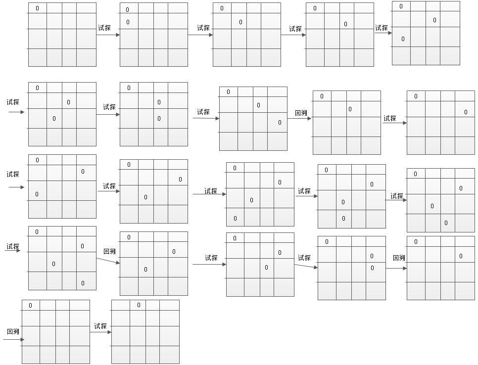

我们在试探的过程中，皇后的放置需要检查他的位置是否和已经放置好的皇后发生冲突，为此需要以及检查函数来检查当前要放置皇后的位置，是不是和其他已经放置的皇后发生冲突

假设有两个皇后被放置在`（i，j）`和`（k，l）`的位置上，明显，当且仅当 `|i-k|=|j-l| ` 时，两个皇后才在同一条对角线上。

1) 先从首位开始检查，如果不能放置，接着检查该行第二个位置，依次检查下去，直到在该行找到一个可以放置一个皇后的地方，然后保存当前状态，转到下一行重复上述方法的检索。 

2) 如果检查了该行所有的位置均不能放置一个皇后，说明上一行皇后放置的位置无法让所有的皇后找到自己合适的位置，因此就要回溯到上一行，重新检查该皇后位置后面的位置。

```c++
int PLACE(int n) /* 检查当前列能否放置皇后 */
{
    //queen[i] == queen[n]用于保证元素不能再同一列
    //abs(queen[i] - queen[n]) == abs(n - i)用于约束元素不能再同一行且不能再同一条斜线上
    int i;
    for(i = 0; i < n; i++) /* 检查横排和对角线上是否可以放置皇后 */
    {
        if(queen[i] == queen[n] || abs(queen[i] - queen[n]) == abs(n - i))
        {
            return 0;
        }
    }
    return 1;
}
```

具体的实现代码如下：

```c++
#define max 4
//sum用于描述解的可能的个数，每当输出一次复合要求的位置
//sum的数量就会被+1
int queen[max], sum=0; /* max为棋盘最大坐标 */

void show() /* 输出所有皇后的坐标 */
{
    int i;
    printf("(");
    //i代表行数，queen[i]代表当前行元素所处的列数，
    //注意此处下标是从0开始的

    for(i = 0; i < max; i++)
    {
         printf(" %d", queen[i]+1);
    }
    printf(")\n");
    //每次输出一种解的时候，那么他的解的数量就会增加1
    sum++;
}

//此函数用于判断皇后当前皇后是否可以放在此位置
int PLACE(int n) /* 检查当前列能否放置皇后 */
{
    //queen[i] == queen[n]用于保证元素不能再同一列
    //abs(queen[i] - queen[n]) == abs(n - i)用于约束元素不能再同一行且不能再同一条斜线上
    int i;
    for(i = 0; i < n; i++) /* 检查横排和对角线上是否可以放置皇后 */
    {
        if(queen[i] == queen[n] || abs(queen[i] - queen[n]) == abs(n - i))
        {
            return 0;
        }
    }
    return 1;
}

//核心函数，回溯法的思想
void NQUEENS(int n) /* 回溯尝试皇后位置,n为横坐标 */
{
    int i;
    for(i = 0; i < max; i++)
    {
        //首先将皇后放在第0列的位置，对于第一次来说是肯定成立的
        //所以第一次将皇后放在第0行0列的位置
        queen[n] = i; /* 将皇后摆到当前循环到的位置 */
        if(PLACE(n))
        {
            if(n == max - 1)
            {
                show(); /* 如果全部摆好，则输出所有皇后的坐标 */
            }
            else
            {
                NQUEENS(n + 1); /* 否则继续摆放下一个皇后 */
            }
        }
    }
}

int main()
{
    NQUEENS(0); /* 从横坐标为0开始依次尝试 */
    printf("\n");
    printf("总共的解法有%d种\n", sum);

    return 0;
}
```

### 习题练习推荐

- N皇后问题是一个经典的问题，在一个N*N的棋盘上放置N个皇后，每行一个并使其不能互相攻击（同一行、同一列、同一斜线上的皇后都会自动攻击），求出有多少种合法的放置方法。输出N皇后问题所有不同的摆放情况个数。---**九度OJ1254**
- 将一堆正整数分为 `2` 组，要求2组的和相差最小.---**51Nod 1007** 参考题解在这里：[http://www.cnblogs.com/ECJTUACM-873284962/p/7572069.html](http://www.cnblogs.com/ECJTUACM-873284962/p/7572069.html)，关于01背包问题更多题目推荐参考这里：[http://www.cnblogs.com/ECJTUACM-873284962/category/997032.html](http://www.cnblogs.com/ECJTUACM-873284962/category/997032.html)
- 符号三角形的 第 `1` 行有 `n` 个由 `“+”` 和 `”-“` 组成的符号 ，以后每行符号比上行少 `1` 个， `2` 个同号下面是 `”+“` ， `2` 个异 号下面是 `”-“ ` 。计算有多少个不同的符号三角形，使其所含 `”+“ ` 和 `”-“ ` 的个数相同 。---**hdu2510**
- 给出两个字符串，求出这样的一个最长的公共子序列的长度：子序列中的每个字符都能在两个原串中找到， 而且每个字符的先后顺序和原串中的先后顺序一致。---**POJ1458**
- 求出最长上升子序列的长度。---**百练2757**
- 从三角形顶部数字走，每次只能走到这个数字的左下角或者右下角的数字，直到底部，计算走过的线路的数字之和，求这个和的最大值。---**POJ1163**。
- 给出两个串，分别为 `a` ， `b` ，问 `a` 串在 `b` 串中出现了几次？(其实位置不同，就算不同的串)。---**hdu1686**

更多题目推荐未来待续更新

### 参考文献

- 动态规划百度百科：https://baike.baidu.com/item/%E5%8A%A8%E6%80%81%E8%A7%84%E5%88%92/529408
- 回溯算法入门及经典案例剖析(初学者必备宝典)：http://www.cnblogs.com/ECJTUACM-873284962/p/8447050.html
- 动态规划：http://www.doc88.com/p-6408257243193.html
- 麻省理工学院公开课：算法导论 ---动态规划，最长公共子序列：http://open.163.com/movie/2010/12/L/4/M6UTT5U0I_M6V2U1HL4.html

### GitHub

本项目会持续更新我对于算法的一些理解以及收集一些优质的题目和writeup，欢迎大家star and fork，一起来打造这个学习的知识体系宝库。

GitHub：[https://github.com/AngelKitty/Algorithm](https://github.com/AngelKitty/Algorithm)